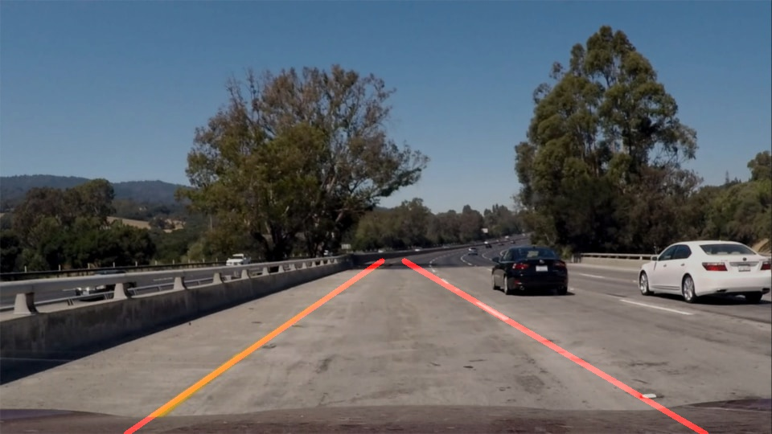

# **Finding Lane Lines on the Road** 

My submission for term 1 project 1, see [P1.ipynb](https://github.com/shunjilin/UdacityCarNDLaneLinesPt1/blob/master/P1.ipynb) for implementation and [writeup.md](https://github.com/shunjilin/UdacityCarNDLaneLinesPt1/blob/master/writeup.md) for details.

Overview
---

When we drive, we use our eyes to decide where to go.  The lines on the road that show us where the lanes are act as our constant reference for where to steer the vehicle.  Naturally, one of the first things we would like to do in developing a self-driving car is to automatically detect lane lines using an algorithm.

In this project you will detect lane lines in images using Python and OpenCV.  OpenCV means "Open-Source Computer Vision", which is a package that has many useful tools for analyzing images.