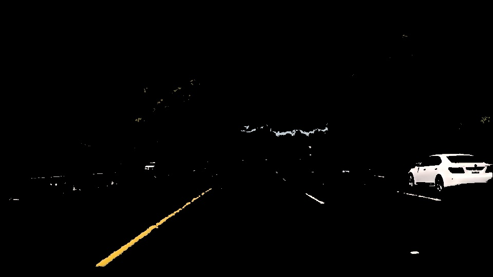

# **Finding Lane Lines on the Road** 

Shunji Lin

---

**Finding Lane Lines on the Road**

The goals / steps of this project are the following:
* Make a pipeline that finds lane lines on the road
* Reflect on your work in a written report

Original image:

---

### Reflection

### 1. Describe your pipeline. As part of the description, explain how you modified the draw_lines() function.

My pipeline consisted of 5 steps.

1. Extract yellow and white lines 

First, I extracted the yellow and white lines from the image, to better identify lane lines. This is done by converting the image from RGB to HSV format, and applying the appropriate color masks. This is as the HSV (hue, saturation, value) model allows for better separation of colors as identified by humans.

2. Apply Gaussian blur

Then I apply Gaussian blur with a relatively large kernel size of 15. This is so as to remove as much noise as possible from the image.

3. Apply Canny edge detector

Then I apply Canny edge detection with a low threshold of 50 and high threshold of 150 to detect the edges which will be used to construct the lane lines drawing.

4. Mask region of interest

Then using the helper function region_of_interest and by defining the vertices of a isoceles trapezoid I mask the are right in front of the car where the lane lines extend.
The application of the mask results in the below:

5. Extract lane lines using Hough Transform and interpolate lines

Finally, I extract the lines from the edges by using Hough transform with an intersection threshold of 20, min_line_length of 20 and max_line_gap of 20. 

Before drawing the lane lines back onto the original image, I apply interpolation by taking a weighted average (by vertical length) of the lines' gradient and centers. To do this I have to separate the lines into the left and right lanes by restricting their gradients (negative for left lane lines and positive for right lane lines). In order to get more accurate lines I also restricted a valid line's absolute gradient to between 0.5 and 4. The draw_lines() function is modified by adding the interpolation step as a preprocessing step for the lines. 

The final result is as follows:

### 2. Identify potential shortcomings with your current pipeline

This pipeline makes a couple of assumptions about lane lines:

1. Lane lines are white and yellow, thus this might not work with lane lines of different colors

2. Lane lines have restricted gradients (absolute value between 0.5 and 4), which might be too restrictive

### 3. Suggest possible improvements to your pipeline

Need to invest more time to tune the various parameters for each step of the pipeline, such as for Guassian blur, Canny edge detection and Hough line transform. Perhaps with better parameters the manual filtering of white and yellow lines as in step 1 might not be necessary, and could make the pipeline more robust to different lane line configurations. However, as of now without the preprocessing step of 1 I could not get the pipeline to perform well on the challenge video.
